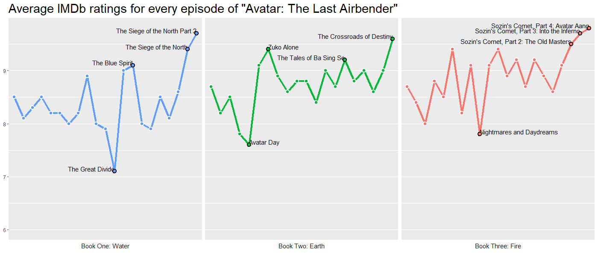

# Ratings for Avatar: The Last Airbender

Having been a long-time fan of “Avatar: The Last Airbender” as well as having seen many graphics in the past year of the decline of Game of Thrones ratings in its final season, I was inspired to investigate how ATLA did in its series finale.

I scraped the ratings from [IMDb](https://www.imdb.com/title/tt0417299/episodes?season=1&ref_=tt_eps_sn_1) using Scrapy and plotted the trends using ggplot2. Credits to [this Upshot article](https://www.nytimes.com/interactive/2019/05/17/upshot/game-of-thrones-imdb-ratings.html) for the plotting style.

[Post](https://www.reddit.com/r/dataisbeautiful/comments/ejovuq/ratings_for_avatar_the_last_airbender_oc/) can be found on r/dataisbeautiful subreddit

